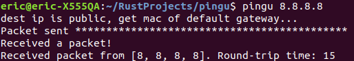

# pingu
Pingu is a playground for implementing network protocols and utilities in Rust. For any utility, the aim is to successfully communicate with a real world host. For example it contains an implementation of [ ping](https://en.wikipedia.org/wiki/Ping_(networking_utility)), that aims to satisfy pages 14 and 15 of [RFC 792](https://datatracker.ietf.org/doc/html/rfc792):

## Why
The idea is to learn-by-doing with regards to network protocols and writing Rust code. An implementation is complete when tested against a real host on a network.

## (Roughly) implemented so far
* [x] Arp
* [x] Ipv4
* [x] Ping
* [x] TCP handshake
* [ ] TCP
* [ ] UDP
* [ ] ...

## Contributions
Contributions of code/feedback/ideas to the playground are very welcome. E.g. if you want to practice implementing a network tool/protocol in Rust.

## Todo

* [ ] Add build instructions to Readme.
